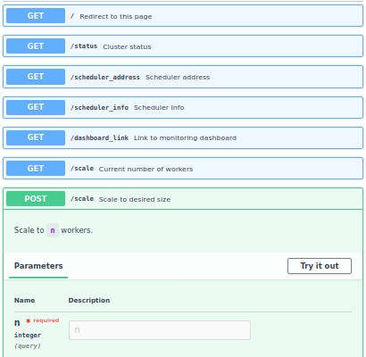
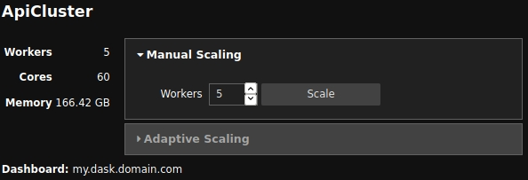
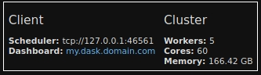

# dask-remote

Aims to collect tools for deploying a persistent `dask` cluster, in particular on Kubernets.

## `dask_remote.runner`


- `ClusterProcess` provides a way to run any `Cluster` in a python process, thus allowing easy way to build CLIs and other non-interactive cluster deployments. The process can manage e.g. a `LocalCluster`, a `KubeCluster`, or a `dask_remote.deployment.DeploymentCluster`.
- `ClusterProcessProxy` provides a process and thread-safe for each `ClusterProcess` to allow access to methods and attributes such as `scale`
- `ApiProcess` provides a way to expose the proxy methods via a RESTful API built on `FastAPI`, as well as a way to run a simple `uvicorn` server exposing this API in a separate process.

With a Cluster and the API server both running, we can e.g. scale the cluster over REST:

```
$ curl -X POST http://localhost:8000/scale/42
```

See [example in `ClusterProcess` README](dask_remote/runner/README.md)

## `dask_remote.client`

- `ApiCluster` provides a way to interact with a remote cluster via a REST API from your code or notebook. It provides the expected methods and an interactive Widget.

| Cluster widget | Client widget |
|---|---|
|  |  |

## `dask_remote.deployment`

Provides a `DeploymentCluster` class for managing scaling via a Kubernetes Deployment of worker Pods.

See [`DeploymentCluster` README](dask_remote/deployment/README.md)
